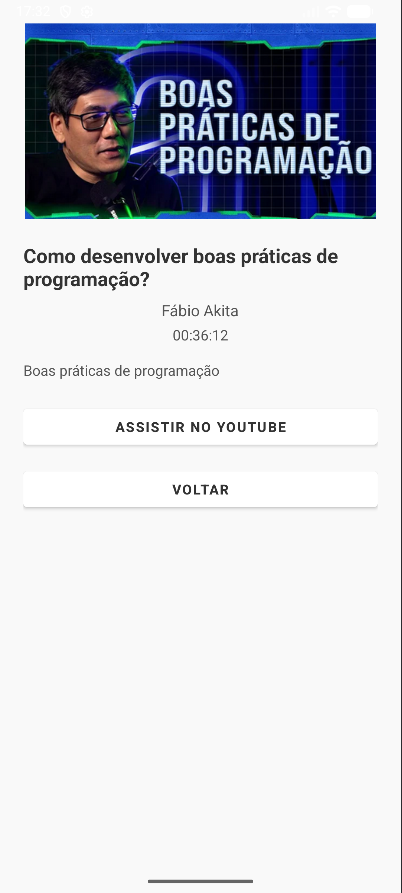
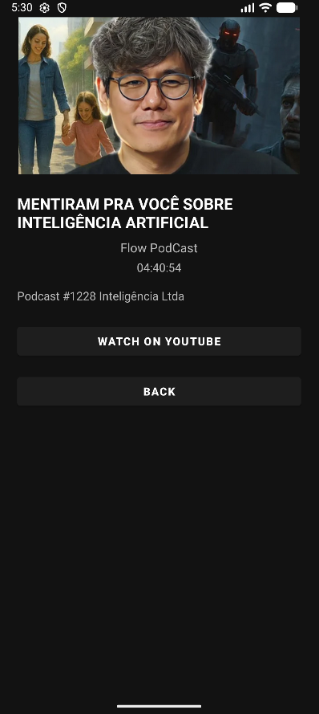

# 🎥 Lista de Vídeos

Aplicativo Android desenvolvido em **Kotlin**, que exibe uma lista de vídeos com informações detalhadas.  
Cada item mostra miniatura, título, canal, duração e descrição do vídeo. Ao clicar em um vídeo, o usuário é direcionado para uma tela de detalhes, onde pode assistir no YouTube ou voltar à lista.

O aplicativo utiliza **tema escuro e tema claro**, proporcionando uma interface moderna e agradável.

---

## 🧩 Funcionalidades
- Lista de vídeos dinâmica com **ListView/RecyclerView**  
- Tela de detalhes com informações completas do vídeo  
- Navegação entre telas usando **Intent**  
- Tema escuro e claro  
- Interface responsiva e organizada

---

## 📱 Screenshots

### Tema Claro em Português

#### Tela 1

  

#### Tela 2

  

### Tema Escuro em Inglês

#### Tela 1

  

#### Tela 2

  

---

## 🎬 Demonstração do Projeto

  

---

## 🛠️ Tecnologias utilizadas
- Kotlin  
- Android Studio  
- RecyclerView / ListView  
- Intent para navegação entre telas  
- Data classes para gerenciamento de dados  

---

## 📖 Autor
Desenvolvido por **Cauan Mendes** 👨‍💻
